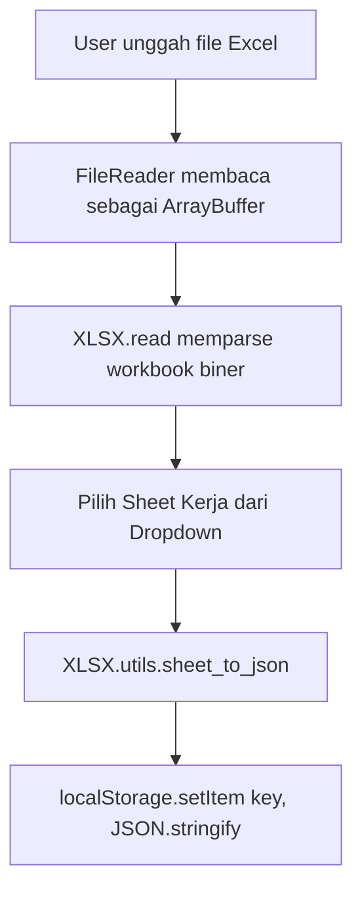

# StorageLearn: Panduan Memproses & Menyimpan Upload File di LocalStorage & IndexedDB

Proyek ini adalah aplikasi web interaktif berbasis **HTML, CSS (Vanilla), dan JavaScript (ES6)** untuk mempelajari mekanisme unggah file (upload), pemrosesan data di sisi klien (client-side parsing), dan penyimpanannya ke dalam **HTML5 LocalStorage** serta pengenalan **IndexedDB** untuk penyimpanan skala besar menggunakan pustaka **SheetJS (XLSX)**.

---

## 💡 Perbandingan: LocalStorage vs IndexedDB

Saat mengembangkan aplikasi web berbasis HTML/CSS/JS lokal, ada dua opsi utama penyimpanan client-side. Berikut adalah perbandingannya:

| Karakteristik | LocalStorage | IndexedDB |
| :--- | :--- | :--- |
| **Kapasitas** | Terbatas (±5 MB per domain) | Sangat besar (50% dari ruang penyimpanan disk bebas perangkat) |
| **Tipe Data** | Hanya Teks (String) | Objek Terstruktur, Biner (Blob, File, ArrayBuffer), JSON |
| **Mode Operasi** | **Synchronous** (Memblokir thread utama UI browser) | **Asynchronous** (Non-blocking, UI tetap responsif) |
| **Pencarian** | Lambat (harus memparse seluruh string JSON) | Cepat (mendukung Indeksasi & Key Ranges) |
| **Transaksional** | Tidak didukung | Didukung (dapat melakukan *rollback* bila terjadi kegagalan) |
| **Keamanan** | Rentan terhadap serangan XSS (dapat dibaca oleh JS apa pun) | Lebih aman, namun tetap terikat pada Same-Origin Policy |

---

## 📂 Tipe-tipe File yang Bisa Di-upload & Cara Pemrosesannya

Berikut adalah cara memproses berbagai jenis berkas sebelum dimasukkan ke media penyimpanan browser:

1. **JSON (`.json`)**: Dibaca sebagai teks biasa, divalidasi ke Object JS via `JSON.parse()`, lalu disimpan kembali sebagai string JSON (`JSON.stringify()`).
2. **Excel (`.xlsx`, `.xls`)**: Dibaca sebagai `ArrayBuffer` biner, kemudian diparsing oleh pustaka **SheetJS** menjadi array objek JSON untuk disimpan ke LocalStorage atau IndexedDB.
3. **CSV (`.csv`)**: Dibaca sebagai teks biasa, dipisahkan baris/kolomnya menjadi data tabular terstruktur.
4. **Gambar (`.png`, `.jpg`, `.webp`)**:
   * **Untuk LocalStorage:** Diubah menjadi string Base64 DataURL (menambah ukuran file ~33%).
   * **Untuk IndexedDB:** Disimpan mentah langsung sebagai file biner (`Blob`), menghemat memori.
5. **Teks Plain (`.txt`)**: Disimpan langsung sebagai teks mentah tanpa konversi.

---

## 🧪 Mekanisme Parsing Excel Menggunakan SheetJS

Untuk membaca data Excel (`.xlsx` atau `.xls`) di sisi klien secara langsung, alur kerjanya adalah:



### Kode Pemrosesan Excel:
```javascript
const reader = new FileReader();
reader.onload = function(e) {
    const data = new Uint8Array(e.target.result);
    const workbook = XLSX.read(data, { type: 'array' });
    const sheetName = workbook.SheetNames[0];
    const worksheet = workbook.Sheets[sheetName];
    const jsonData = XLSX.utils.sheet_to_json(worksheet);
    
    localStorage.setItem('key_excel', JSON.stringify(jsonData));
};
reader.readAsArrayBuffer(file);
```

---

## 🛠️ Struktur Proyek

- **`index.html`**: Antarmuka dashboard modern (Light Blue Glassmorphism) berisi kontrol uploader, monitor memori, tab edukasi, dan visualizer data.
- **`style.css`**: Desain visual responsif bertema biru muda terang dengan transparansi kaca (*backdrop-filter blur*) dan bayangan lembut.
- **`app.js`**: Logika upload, integrasi API *FileReader*, pustaka *SheetJS*, perhitungan memori, dan visualisasi data.
- **`README.md`**: Dokumentasi ini.

---

## 🚀 Cara Menjalankan Aplikasi Secara Lokal

Anda dapat langsung menjalankan aplikasi ini tanpa instalasi server yang rumit karena aplikasi ini murni berjalan di sisi client.

### Metode 1: Menggunakan Browser Langsung
1. Buka folder proyek ini di komputer Anda.
2. Klik ganda file `index.html` untuk membukanya di browser.

### Metode 2: Menggunakan Local Development Server (Rekomendasi)
Agar fitur modul atau resource eksternal berjalan optimal tanpa batasan protokol `file://`:

**Menggunakan Node.js (`live-server`):**
```bash
npx live-server
```
Atau menggunakan **Python**:
```bash
python -m http.server 8000
```
Buka `http://localhost:8000` pada browser Anda.
